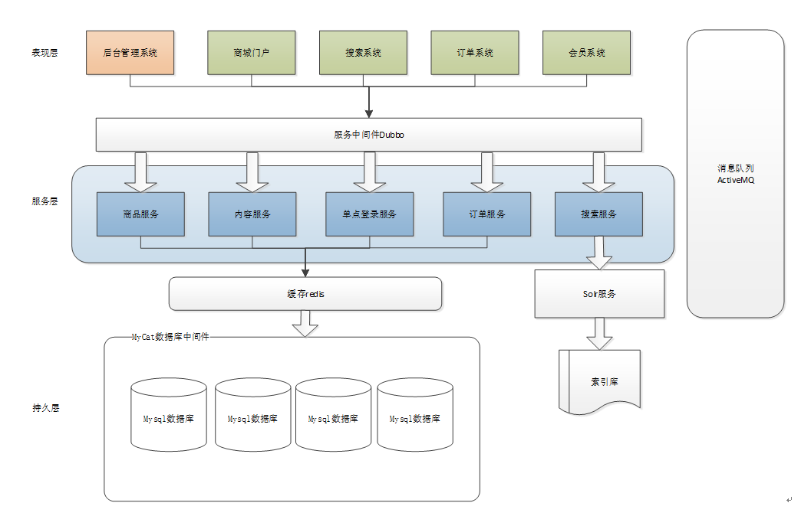

# wego

## 项目介绍

前台商城系统包含首页门户、商品分类、添加商品、首页轮播、商品搜索、商品展示、购物车、订单结算、个人订单管理等模块。 后台管理系统包含轮播图管理、商品管理、订单管理、分类管理等模块。

### 组织结构

``` lua
mall
├── wego-common -- 工具类及通用代码
├── wego-manager -- 商城模块管理
├── wego-order -- 电商订单模块
├── wego-content -- 商品内容模块
├── wego-search -- 商品搜索系统
├── wego-portal -- 前台商城系统接口
└── wego-sso -- 系统单点登录模块
```

### 技术选型

#### 后端技术

| 技术                 | 说明                | 官网                                                 |
| -------------------- | ------------------- | ---------------------------------------------------- |
| Spring               | 容器+MVC框架        | https://spring.io                                   |
| MyBatis              | ORM框架             | http://www.mybatis.org/mybatis-3/zh/index.html       |
| PageHelper           | MyBatis物理分页插件 | http://git.oschina.net/free/Mybatis_PageHelper       |
| ActiveMq             | 消息队列            | https://activemq.apache.org/                         |
| Redis                | 分布式缓存          | https://redis.io/                                    |
| Mysql                | 数据库             | https://www.mysql.com                             |
| Docker               | 应用容器引擎        | https://www.docker.com                               |
| Druid                | 数据库连接池        | https://github.com/alibaba/druid                     |

#### 架构图

##### 系统架构图



## 环境搭建

### 开发工具

| 工具          | 说明                | 官网                                            |
| ------------- | ------------------- | ----------------------------------------------- |
| IDEA          | 开发IDE             | https://www.jetbrains.com/idea/download         |
| Navicat       | 数据库连接工具      | http://www.formysql.com/xiazai.html             |
| MindMaster    | 思维导图设计工具    | http://www.edrawsoft.cn/mindmaster              |
| ProcessOn     | 流程图绘制工具      | https://www.processon.com/                      |
| Snipaste      | 屏幕截图工具        | https://www.snipaste.com/                       |
| Postman       | API接口调试工具      | https://www.postman.com/                        |


### 开发环境

| 工具          | 版本号 | 下载                                                         |
| ------------- | ------ | ------------------------------------------------------------ |
| JDK           | 1.8    | https://www.oracle.com/technetwork/java/javase/downloads/jdk8-downloads-2133151.html |
| Mysql         | 5.7    | https://www.mysql.com/                                       |
| Redis         | 3.2    | https://redis.io/download                                    |
| ActiveMq      | 5.13.0 | https://activemq.apache.org/                        |
| Nginx         | 1.10   | http://nginx.org/en/download.html                            |
| zookeeper     | 3.4.12 | https://archive.apache.org/dist/zookeeper/zookeeper-3.4.12/zookeeper-3.4.12.tar.gz    |
| Solr          | 4.10.4 | http://archive.apache.org/dist/lucene/solr/4.10.4/solr-4.10.4.tgz  |
